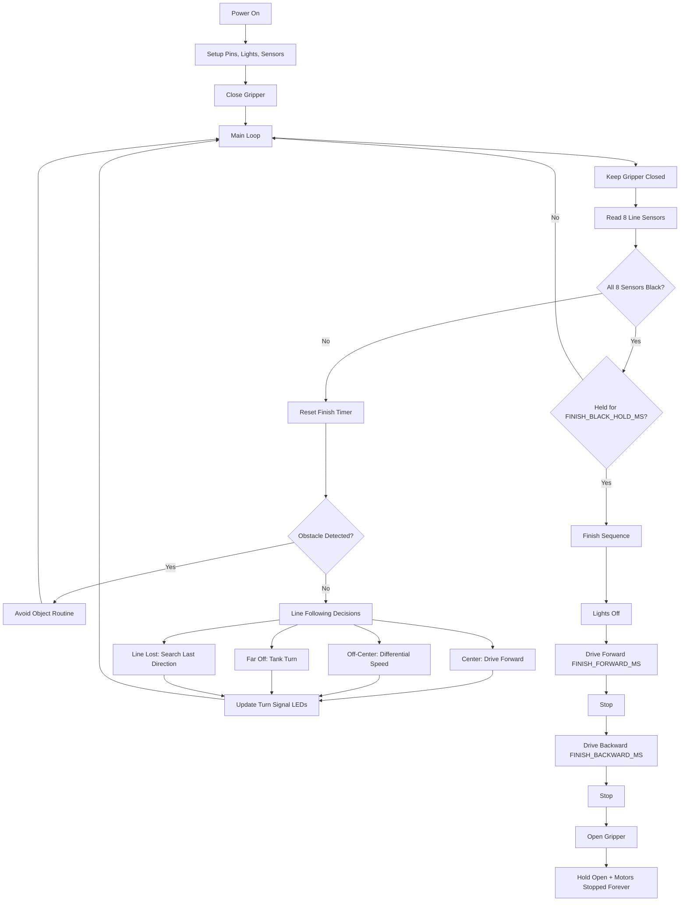

# Race Day Robot Guide

This guide explains how our robot works.

The robot has three main jobs:
1. Starts the race for our team.
2. Follows the black line as fast and smoothly as possible.
3. Detects the finish area and runs its finish sequence.

## System Flow Diagram



---

## 1. Starting Procedure

When the robot is powered on, it prepares all hardware:
- Motor pins are set so the robot can drive.
- Sensor pins are set so it can read the line.
- Ultrasonic sensor pins are set so it can detect obstacles.
- NeoPixel lights are initialized.
- Gripper servo is set to closed.


### Important startup code

```cpp
void setup() {
  pinMode(SERVO_PIN, OUTPUT);

  pinMode(MOTOR_LEFT_FORWARD, OUTPUT);
  pinMode(MOTOR_LEFT_BACK, OUTPUT);
  pinMode(MOTOR_RIGHT_FORWARD, OUTPUT);
  pinMode(MOTOR_RIGHT_BACK, OUTPUT);
  pinMode(ULTRASONIC_TRIG, OUTPUT);
  pinMode(ULTRASONIC_ECHO, INPUT);

  pixels.begin();
  pixels.setBrightness(50);
  pixels.show();

  // Start with gripper closed.
  servoWrite(SERVO_CLOSED_PULSE);
}
```

---

## 2. Following Line

The robot uses 8 line sensors (left to right) to decide steering.

### How the sensors are interpreted

- A sensor value above `BLACK_THRESHOLD` means that sensor sees black line.
- Middle sensors (`3` and `4`) are most important for straight driving.
- If the line drifts left or right, speed is adjusted between wheels.
- If the line is far to one side, robot uses a tank turn.
- If no sensor sees the line, it keeps turning in the last known direction until it finds it again.

### Core sensor read + finish-check block

```cpp
for (int i = 0; i < NUM_SENSORS; i++) {
  sensorValues[i] = analogRead(SENSOR_PINS[i]);
}

if (areAllSensorsBlack()) {
  if (allBlackStartMs == 0) {
    allBlackStartMs = millis();
  } else if (millis() - allBlackStartMs >= FINISH_BLACK_HOLD_MS) {
    finishRace();
  }
} else {
  allBlackStartMs = 0;
}
```

Basic explanation:
- The robot quickly reads all 8 sensors.
- If all sensors see black, it starts a timer.
- It only finishes if all-black stays true long enough.
- If black is not continuous, timer resets (so we don't finish the race at intersections).

### Steering examples

```cpp
if (sensorValues[3] > BLACK_THRESHOLD && sensorValues[4] > BLACK_THRESHOLD) {
  driveForward(SPEED_FULL, SPEED_FULL);
} else if (sensorValues[3] > BLACK_THRESHOLD) {
  driveForward(SPEED_FULL, SPEED_SLIGHT_CORRECT);
} else if (sensorValues[4] > BLACK_THRESHOLD) {
  driveForward(SPEED_SLIGHT_CORRECT, SPEED_FULL);
}
```

What this does:
- Centered on line: both wheels fast.
- Line slightly right: slow right wheel a little to curve right.
- Line slightly left: slow left wheel a little to curve left.

### Obstacle behavior while following line

The robot checks distance using the ultrasonic sensor.
If something is too close, it runs `avoidObject()` and then returns to line following.

```cpp
if (isObstacleDetected()) {
  avoidObject();
  return;
}
```

---

## 3. Finish Procedure

The finish is detected when all 8 sensors see black continuously for a short period of time.
This is used because track intersections can briefly look like finish.

Once finish is confirmed, the robot runs this sequence:
1. Lights off.
2. Drive forward for `FINISH_FORWARD_MS`.
3. Stop.
4. Drive backward for `FINISH_BACKWARD_MS`.
5. Stop.
6. Open gripper (release object).
7. Final state: gripper stays open and motors stay stopped forever.

### Finish code snippet

```cpp
void finishRace() {
  lightsOff();

  driveForward(FINISH_SEQUENCE_SPEED, FINISH_SEQUENCE_SPEED);
  delay(FINISH_FORWARD_MS);
  stopMotors();

  driveBackward(FINISH_SEQUENCE_SPEED, FINISH_SEQUENCE_SPEED);
  delay(FINISH_BACKWARD_MS);
  stopMotors();

  servoWrite(SERVO_OPEN_PULSE);

  while (true) {
    servoWrite(SERVO_OPEN_PULSE);
    stopMotors();
  }
}
```