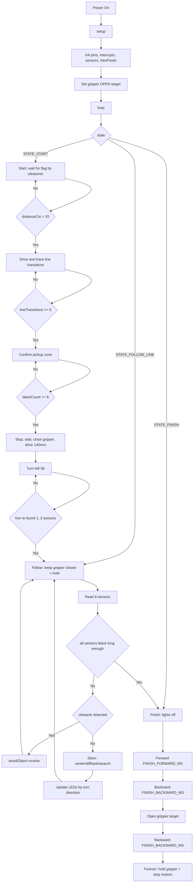

# Race Day Robot Guide

This guide matches the current behavior in `race-day.ino`.

The robot has 3 top-level states:
1. `STATE_START`
2. `STATE_FOLLOW_LINE`
3. `STATE_FINISH`

## Updated Activity Diagram

```mermaid
flowchart TD
  A[Power On] --> B[setup]
  B --> C[Init pins, interrupts, sensors, NeoPixels]
  C --> D[Set gripper OPEN target]
  D --> E[loop]

  E --> F{state}

  F -->|STATE_START| S0
  F -->|STATE_FOLLOW_LINE| L0
  F -->|STATE_FINISH| X0

  S0[Start: wait for flag by ultrasonic] --> S1{distanceCm > 20}
  S1 -->|No| S0
  S1 -->|Yes| S2[Drive and track line transitions]
  S2 --> S3{lineTransitions >= 6}
  S3 -->|No| S2
  S3 -->|Yes| S4[Confirm pickup zone]
  S4 --> S5{blackCount >= 6}
  S5 -->|No| S4
  S5 -->|Yes| S6[Stop, wait, close gripper, drive 140mm]
  S6 --> S7[Turn left 90]
  S7 --> S8{line re-found 1..3 sensors}
  S8 -->|No| S7
  S8 -->|Yes| L0

  L0[Follow: keep gripper closed + hold] --> L1[Read 8 sensors]
  L1 --> L2{all sensors black long enough}
  L2 -->|Yes| X0
  L2 -->|No| L3{obstacle detected}
  L3 -->|Yes| L4[avoidObject routine]
  L4 --> L0
  L3 -->|No| L5[Steer: center/diff/tank/search]
  L5 --> L6[Update LEDs by turn direction]
  L6 --> L0

  X0[Finish: lights off] --> X1[Forward FINISH_FORWARD_MS]
  X1 --> X2[Backward FINISH_BACKWARD_MS]
  X2 --> X3[Open gripper target]
  X3 --> X4[Backward FINISH_BACKWARD_MS]
  X4 --> X5[Forever: hold gripper + stop motors]
```

---

## Robot Guide

## 1. Main Loop State Machine

`loop()` dispatches by state:
- `STATE_START` -> `runStartProcedure()`
- `STATE_FOLLOW_LINE` -> `runFollowLineProcedure()`
- `STATE_FINISH` -> `runFinishProcedure()`

## 2. Start Procedure

`runStartProcedure()` uses named phase constants:
- `START_PHASE_WAIT_FLAG`: wait until ultrasonic distance is valid and `> 20 cm`.
- `START_PHASE_DRIVE_TO_LINE`: move forward while counting line transitions.
- `START_PHASE_CONFIRM_PICKUP_ZONE`: confirm black square area.
- `START_PHASE_SET_CLOSE_TIMER` + `START_PHASE_WAIT_AFTER_CLOSE`: short wait before close-and-drive.
- `START_PHASE_CLOSE_AND_DRIVE`: drive `140.0 mm`, close gripper, short delay.
- `START_PHASE_TURN_LEFT`: `turn(-90)`.
- `START_PHASE_FIND_LINE`: detect line and switch to follow state.

## 3. Line Following

In `runFollowLineProcedure()`:
- Gripper is kept closed with `setGripperTarget(SERVO_CLOSED_PULSE)` and periodic `holdGripper()`.
- All 8 sensors are read every cycle.
- Finish is detected by sustained all-black detection (`FINISH_BLACK_HOLD_MS`).
- Obstacle check is run every `OBSTACLE_CHECK_INTERVAL_MS`.
- Steering logic:
1. Center sensors -> full forward
2. Slight offsets -> differential wheel speed
3. Outer sensors -> tank turns
4. No line -> search in last known direction
- LEDs are updated based on turn direction (`left`, `right`, `forward`, `stop`).

## 4. Obstacle Avoidance

`avoidObject()` performs a fixed detour sequence:
- Stop
- Right turn
- Forward
- Left turn
- Forward
- Left turn
- Forward until line is detected, then return to follow state

## 5. Finish Procedure

`runFinishProcedure()` sequence:
1. Lights off
2. Forward for `FINISH_FORWARD_MS`
3. Backward for `FINISH_BACKWARD_MS`
4. Set gripper to open
5. Backward for `FINISH_BACKWARD_MS` again
6. Infinite hold: keep gripper pulse alive and motors stopped

## 6. Helper Systems

- `setGripperTarget(...)`: updates the commanded servo pulse width (for example `SERVO_OPEN_PULSE` or `SERVO_CLOSED_PULSE`), immediately transmits the new pulse, and refreshes the hold timer.
- `holdGripper()`: sends small repeat signals so the gripper keeps holding the object firmly
- `setLightsByMode(...)`: changes robot lights only when needed
- `driveDistance(...)` and `turn(...)`: make the robot move an exact distance or turn by an exact angle